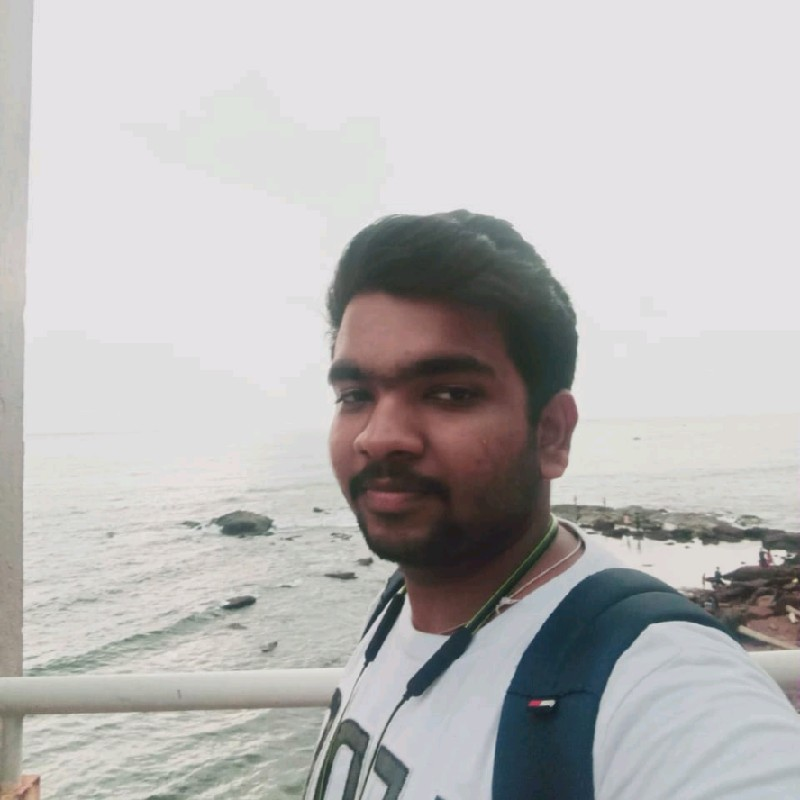
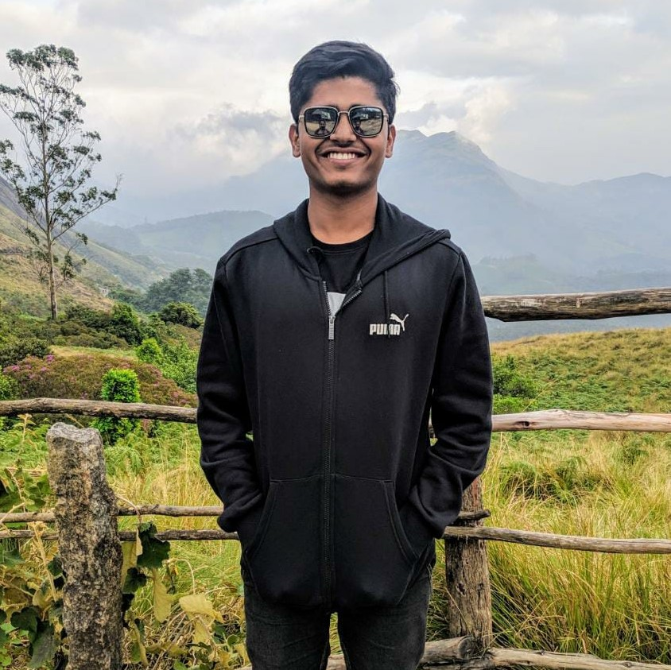
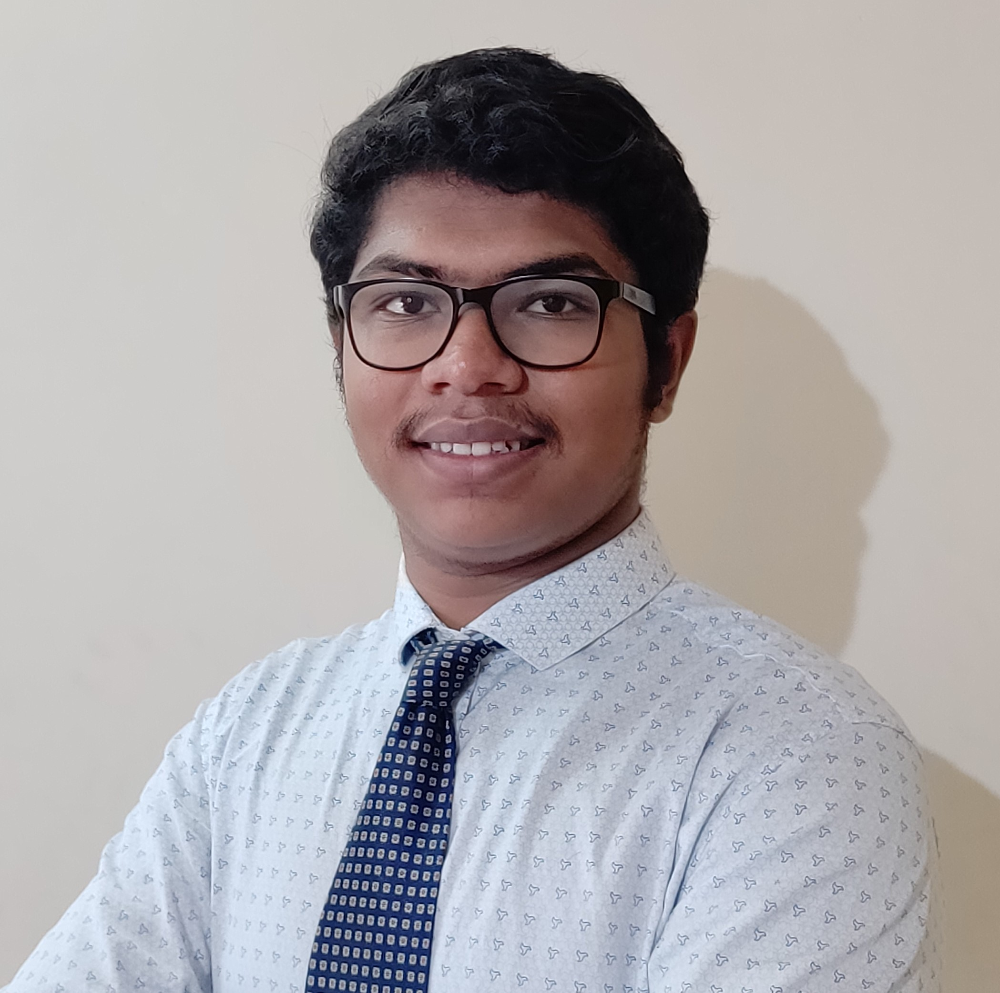

<!-- Main -->

<!-- One -->
<section id="one">
    

        <header class="major">
            <h1>About Us</h1>
        </header>

<!-- Content -->

	

    	
The Electronics and Robotics Club (ERC) of BITS Goa is a diverse group of students with interests ranging from electronics to machine learning to mechanical design. Founded in 2008, it is one of the oldest clubs on campus and has evolved into a platform to learn and experiment with various aspects of science and engineering and to apply them in robotics.

		
This Club is a great place not only for electronics engineers but also mechanical enthusiasts and dynamic coders. We are organised into multiple teams working on a wide range of projects including hardware design, open source libraries and even full robots from scratch!  Members are also encouraged to exchange experiences and expertise and we hold weekly discussion sessions, demonstrations and presentations for exactly that.

		
Over the years, the Club has shifted its focus from competing in robotics competitions to taking on more research oriented projects and problem statements with real world applications. With robotics being a rapidly changing field, we strive to keep up with the latest developments in both research and industry while also learning about various subfields in detail. Apart from this, we frequently work on exhibition projects to display during the annual technical fest on the campus and other events throughout the year.

		
We are open to anyone with a general interest in engineering and who wants to explore robotics, so feel free to get in touch with us.

	

<!-- Two -->
<section id="two">
	

		<header class="major">
			<h1>Meet the family ^_^</h1>
		</header>

	
	 
	<h3>2019-2020</h3>
	

<header class="major">
<h1 id="content">Core Team</h1>
</header>

<h2>Coordinators</h2>

    

		

		

			
			 
			<h3><u><a href="https://threewisemonkeys-as.github.io" target="blank">Atharv Sonwane</a></u></h3>
			Chief Coordinator 2020-2021
		

		

	

	

		

		

			
			 
			<h3><u><a href="https://www.instructables.com/member/DangerousTim/" target="blank">Tanmay Bhonsale</a></u></h3>
			Research Head 2020-2021
		

		

	

	

		

		

			
			 
			<h3><u><a href="https://veds12.github.io/" target="blank">Vedant Shah</a></u></h3>
			Teaching Head 2020-2021
		

		

	

	

		

		

			
			 
			<h3><u><a href="https://www.linkedin.com/in/ashutosh-gupta781/" target="blank">Ashutosh Gupta</a></u></h3>
			Media Head 2020-2021
		

		

	

	

		

		

			
			 
			<h3><u><a href="https://www.linkedin.com/in/pranav-goyal-010b08197/" target="blank">Pranav Goyal</a></u></h3>
			Media Head 2020-2021
		

		

	

	

	

	

		

		

			
			 
			<h3><u><a href="https://www.linkedin.com/in/cheriyan-homey-b4a7a9188/" target="blank">Cheriyan Homey</a></u></h3>
			Inventory Head 2020-2021
		

		

	

	

		

		

			
			 
			<h3><u><a href="https://www.linkedin.com/in/yash-jangir-6a71651a1/" target="blank">Yash Jangir</a></u></h3>
			Inventory Head 2020-2021
		

		

	

<h2>Core Members</h2>

	

		

		

			
			 
			<h3><u><a href="https://www.linkedin.com/in/advait-kulkarni-5574b21aa/" target="blank">Advait Kulkarni</a></u></h3>
			Media Head 2019-2020
		

		

	

	
	

		

		

			
			 
			<h3><u><a href="https://in.linkedin.com/in/eash-vrudhula-a11b64170" target="blank">Eash Vrudhula</a></u></h3>
			Media Head 2019-2020
		

		

	

	

		

		

			
			 
			<h3><u><a href="https://www.linkedin.com/in/mohit-chaudhari-759130171/" target="blank">Mohit Chaudhari</a></u></h3>
			Inventory Head 2019-2020
		

		

	

	

		

		

			
			 
			<h3><u><a href="https://www.linkedin.com/in/aditya-bidwai-27980016b/" target="blank">Aditya Bidwai</a></u></h3>
			Core Member
		

		

	

	

		

		

		    
			 
			<h3><u><a href="http://www.linkedin.com/in/anirudha-shrinivas-87a3811b0" target="blank">Anirudha Shrinivas</a></u></h3>
			Core Member
		

		

	

	

		

		

			
			 
			<h3><u><a href="https://www.linkedin.com/in/shivangi-gupta-3429aa8b" target="blank">Shivangi Gupta</a></u></h3>
			Core Member
		

		

	

	

		

		

			
			 
			<h3><u><a href="https://www.linkedin.com/in/vishal-singh-b51b52158/" target="blank">Vishal Singh</a></u></h3>
			Core Member
		

		

	

	

		

		

			
			 
			<h3><u><a href="https://www.linkedin.com/in/abhishek-dixit-ba8497185" target="blank">Abhishek Dixit</a></u></h3>
			Core Member
		

		

	

	

		

		

			
			 
			<h3><u><a href="https://www.linkedin.com/in/aadharsharma218/" target="blank">Aadhar Sharma</a></u></h3>
			Core Member
		

		

	

	

		

		

			
			 
			<h3><u><a href="https://www.linkedin.com/in/shambhavi-singh-14a5b11b0/" target="blank">Shambhavi Singh</a></u></h3>
			Core Member
		

		

	

	

		

		

			
			 
			<h3><u><a href="https://www.linkedin.com/in/rohan-kunjir-1b3043130/" target="blank">Rohan Kunjir</a></u></h3>
			Core Member
		

		

	

	

		

		

			
			 
			<h3><u><a>Shaktivelan Kartikeyan</a></u></h3>
			Core Member
		

		

	

<header class="major">
<h1 id="content">Alumni</h1>
</header>

<h2> 2019-20 </h2>

	

		

		

			
			 
			<h3><u><a href="https://www.linkedin.com/in/tejas-rane-359590149/" target="blank">Tejas Rane</a></u></h3>
			Chief Coordinator 2019-2020 
			Intern at RBCCPS, IISc Bangalore
		

		

	

	

		

		

			
			 
			<h3><u><a href="https://www.linkedin.com/in/rishikesh-vanarse-8032aa169/" target="blank">Rishikesh Vanarse</a></u></h3>
			Sub Coordinator 2019-2020 
			Research Intern at ARL, UNR
		

		

	

	

		

		

			
			 
			<h3><u><a href="https://hardesh.github.io/" target="blank">Harshal Deshpande</a></u></h3>
			Teaching Head 2019-2020 
			Research Intern at ARL, UNR
		

		

	

	

		

		

			
			 
			<h3><u><a href="https://www.linkedin.com/in/prathmesh-thorwe-b76469153/" target="blank">Prathmesh Thorwe</a></u></h3>
			Technical Head 2019-2020 
			Research Intern at EmbedOS
		

		

	

	

		

		

			
			 
			<h3><u><a href="https://www.linkedin.com/in/aditya-phopale-666a7515b/" target="blank">Aditya Phopale</a></u></h3>
			Mechanical Head 2019-2020 
			Research Thesis at IIT Madras
		

		

	

	

		

		

			
			 
			<h3><u><a href="https://www.linkedin.com/in/mohit-sushil-gupta-7a3821184/" target="blank">Mohit Gupta</a></u></h3>
			Research Head 2019-2020 
			Thesis at CSIR-NIO
		

		

	

	

		

		

			
			 
			<h3><u><a href="https://ojitmehta123.github.io/" target="blank">Ojit Mehta</a></u></h3>
			Thesis at Air Lab,CMU
		

		

	

	

		

		

			
			 
			<h3><u><a href="https://www.researchgate.net/profile/Sanket_Yannuwar" target="blank">Sanket Yannuwar</a></u></h3>
			Intern at Divgi TorqTransfer Systems
		

		

	

<h2> 2018-19 </h2>

	

		

		

			
			 
			<h3><u><a href="http://amoghdabholkar.github.io/" target="blank">Amogh Dabholkar</a></u></h3>
			Chief Coordinator 2018-2019 
			Computer Vision Research Fellow at DreamVu
		

		

	

	

		

		

			
			 
			<h3><u><a href="https://sites.google.com/goa.bits-pilani.ac.in/mihir-kulkarni/" target="blank">Mihir Kulkarni</a></u></h3>
			Sub Coordinator 2018-2019 
			PhD Student at University Of Nevada, Reno
		

		

	

	

		

		

			
			 
			<h3><u><a href="https://www.linkedin.com/in/jaideep-g-v-s-s-09b75215a" target="blank">G V S S Jaideep Ram</a></u></h3>
			Technical Head 2018-2019 
			Research Intern at University of Lisbon.
		

		

	

	

		

		

			
			 
			<h3><u><a href="https://www.linkedin.com/in/kapi-ketan-m-a71b3692/" target="blank">Kapi Ketan Mehta</a></u></h3>
			Mechanical Head 2018-2019 
			MS Student at Johns Hopkins.
		

		

	

	

		

		

			
			 
			<h3><u><a href="https://www.linkedin.com/in/mihir-dharmadhikari/" target="blank">Mihir Dharmadhikari</a></u></h3>
			Research Head 2018-2019 
			PhD Student at University of Nevada, Reno.
		

		

	

	

		

		

			
			 
			<h3><u><a href="https://www.linkedin.com/in/yash-pandit-2929b7144/" target="blank">Yash Pandit</a></u></h3>
			Digital Verification Engineer , Analog Devices Bangalore
			
		

		

	

<h2> 2017-18 </h2>

	

		

		

			
			 
			<h3><u><a href="https://www.linkedin.com/in/" target="blank">Abhimanyu</a></u></h3>
			Chief Coordinator 2017-2018
		

		

	

	
	

		

		

			
			 
			<h3><u><a href="https://www.linkedin.com/in/svc97/" target="blank">Shubham Chavan</a></u></h3>
			Sub Coordinator 2017-2018 
			Masters in Robotics & Control, Columbia
		

		

	

	

		

		

			
			 
			<h3><u><a href="https://www.linkedin.com/in/abhishek-moitra-52696798/" target="blank">Abhishek Moitra</a></u></h3>
			Teaching Head 2017-2018 
			Doctoral student, Yale University
		

		

	

	

		

		

			
			 
			<h3><u><a href="https://rohangodiyal.wixsite.com/rohan-godiyal" target="blank">Rohan Godiyal</a></u></h3>
			Research Head 2017-2018 
			Mechanical Design Engineer, WCB Robotics
		

		

	

	

		

		

			
			 
			<h3><u><a href="https://www.facebook.com/smit.rajguru/" target="blank">Smit Rajguru</a></u></h3>
			Interned at IBM 
			Silicon Valley Startup
		

		

	

	

		

		

			
			 
			<h3><u><a href="https://www.linkedin.com/in/" target="blank">Nikhil Khedekar</a></u></h3>
			 Core Member
		

		

	

	

		

		

			
			 
			<h3><u><a href="https://www.linkedin.com/in/utkarshsarawgi" target="blank">Utkarsh Sarawgi</a></u></h3>
			MS Student and Researcher at MIT
		

		

	

	

		

		

			
			 
			<h3><u><a href="https://www.linkedin.com/in/shubham-kumar-1410" target="blank">Shubham Kumar</a></u></h3>
			Software Developer at Publicis Sapient
		

		

	

<h2> 2016-17 </h2>

	

		

		

			
			 
			<h3><u><a href="https://www.linkedin.com/in/anand-dugad" target="blank">Anand Dugad</a></u></h3>
			Chief Coordinator 2016-2017 
			Senior Datapath Design Engineer, WD
		

		

	

	

		

		

			
			 
			<h3><u><a href="https://www.linkedin.com/in/sanjeev-murthy" target="blank">Sanjeev Murthy</a></u></h3>
			Sub Coordinator 2016-2017 
			FPGA Engineer, Apple
		

		

	

	

		

		

			
			 
			<h3><u><a href="https://www.linkedin.com/in/" target="blank">Shubhan Patni</a></u></h3>
			 Core Member
		

		

	

	

		

		

			
			 
			<h3><u><a href="mailto:parva@ezquant.in" target="blank">Parva Patel</a></u></h3>
			Founder EzQuant
		

		

	

	

		

		

			
			 
			<h3><u><a href="https://www.linkedin.com/in/tejas-zodage-4abb1412a" target="blank">Tejas Zodage</a></u></h3>
			Masters in Robotics and Research, CMU
		

		

	

	

		

		

			
			 
			<h3><u><a href="https://www.linkedin.com/in/" target="blank">Akshay Sancheti</a></u></h3>
			Core Member
		

		

	

	

		

		

			
			 
			<h3><u><a href="https://www.linkedin.com/in/ananyo-rao" target="blank">Ananyo Rao</a></u></h3>
			Cloud Computing Engineer, Qubole
		

		

	

