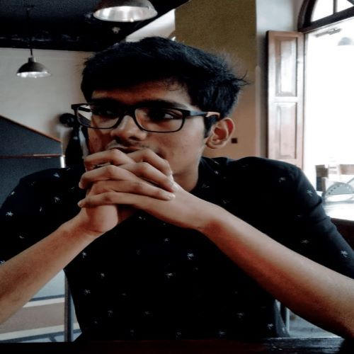

<!-- Main -->

<!-- One -->
<section id="one">
    

        <header class="major">
            <h1>About Us</h1>
        </header>

<!-- Content -->

	

    	
 The ERC is diverse group of students based in BITS Goa, all sharing a love of robotics. Through various projects we explore all facets of robotics ranging from mechanical design, electronics, automation to a combination of all three. We also hold community programs to promote robotics within the student community as well working on various display projects.

		
 Apart from electronics lovers we also welcome mechanical and coding enthusiasts or just about anyone interested in doing robotics regardless of experience or skill level. If you want to join us or even just learn more, feel free to mail at 

	

<!-- Two -->
<section id="two">
	

		<header class="major">
			<h1>Meet the family ^_^</h1>
		</header>

	
	 
	<h3>2019-2020</h3>
	

<header class="major">
<h1 id="content">Core Team</h1>
</header>

<h2>Coordinators</h2>

	

		

		

			
			 
			<h3><u><a href="https://threewisemonkeys-as.github.io">Atharv Sonwane</a></u></h3>
			Chief Coordinator 2020-2021
		

		

	

	

		

		

			
			 
			<h3><u><a href="https://www.instructables.com/member/DangerousTim/">Tanmay Bhonsale</a></u></h3>
			Research Head 2020-2021
		

		

	

	

		

		

			
			 
			<h3><u><a href="https://github.com/veds12">Vedant Shah</a></u></h3>
			Teaching Head 2020-2021
		

		

	

	

		

		

			
			 
			<h3><u><a href="https://www.linkedin.com/in/ashutosh-gupta781/">Ashutosh Gupta</a></u></h3>
			Media Head 2020-2021
		

		

	

	

		

		

			
			 
			<h3><u><a href="https://www.linkedin.com/in/pranav-goyal-010b08197/">Pranav Goyal</a></u></h3>
			Media Head 2020-2021
		

		

	

	

	

	

		

		

			
			 
			<h3><u><a href="https://www.linkedin.com/in/yash-jangir-6a71651a1/">Yash Jangir</a></u></h3>
			Inventory Head 2020-2021
		

		

	

	

		

		

			
			 
			<h3><u><a href="https://www.linkedin.com/in/cheriyan-homey-b4a7a9188/">Cheriyan Homey</a></u></h3>
			Inventory Head 2020-2021
		

		

	

	

	

	

	

<h2>Core Members</h2>

	

		

		

			
			 
			<h3><u><a href="https://www.linkedin.com/in/aditya-bidwai-27980016b/">Aditya Bidwai</a></u></h3>
			Core Member
		

		

	

	

		

		

			
			 
			<h3><a href="https://www.linkedin.com/in/mohit-chaudhari-759130171/">Mohit Chaudhari</a></h3>
			Core Member
		

		

	

	

		

		

		    
			 
			<h3><u><a href="http://www.linkedin.com/in/anirudha-shrinivas-87a3811b0">Anirudha Shrinivas</a></u></h3>
			Core Member
		

		

	

	

		

		

			
			 
			<h3><u><a href="https://www.linkedin.com/in/shivangi-gupta-3429aa8b">Shivangi Gupta</a></u></h3>
			Core Member
		

		

	

	

		

		

			
			 
			<h3><u><a href="https://in.linkedin.com/in/eash-vrudhula-a11b64170">Eash Vrudhula</a></u></h3>
			Core Member
		

		

	

	

		

		

			
			 
			<h3><u><a href="https://www.linkedin.com/in/vishal-singh-b51b52158/">Vishal Singh</a></u></h3>
			Core Member
		

		

	

	

		

		

			
			 
			<h3><u><a href="https://www.linkedin.com/in/abhishek-dixit-ba8497185">Abhishek Dixit</a></u></h3>
			Core Member
		

		

	

<header class="major">
<h1 id="content">Alumni</h1>
</header>

<h2> 2019-20 </h2>

	

		

		

			
			 
			<h3><u><a href="https://www.linkedin.com/in/tejas-rane-359590149/">Tejas Rane</a></u></h3>
			Chief Coordinator 2019-2020
		

		

	

	

		

		

			
			 
			<h3><u><a href="https://hardesh.github.io/">Harshal Deshpande</a></u></h3>
			Teaching Head 2019-2020
			Research Intern at ARL, UNR
		

		

	

	

		

		

			
			 
			<h3><u><a href="https://www.linkedin.com/in/rishikesh-vanarse-8032aa169/">Rishikesh Vanarse</a></u></h3>
			Sub Coordinator 2019-2020
			Research Intern at ARL, UNR
		

		

	

	

		

		

			
			 
			<h3><u><a href="https://www.linkedin.com/in/prathmesh-thorwe-b76469153/">Prathmesh Thorwe</a></u></h3>
			Technical Head 2019-2020
		

		

	

	

		

		

			
			 
			<h3><u><a href="https://www.linkedin.com/in/aditya-phopale-666a7515b/">Aditya Phopale</a></u></h3>
			Mechanical Head 2019-2020
		

		

	

	

		

		

			
			 
			<h3><u><a href="https://www.linkedin.com/in/mohit-sushil-gupta-7a3821184/">Mohit Gupta</a></u></h3>
			Research Head 2019-2020
		

		

	

	

		

		

			
			 
			<h3><u><a href="https://ojitmehta123.github.io/">Ojit Mehta</a></u></h3>
			Alumni
		

		

	

<h2> 2018-19 </h2>

	

		

		

			
			 
			<h3><u><a href="http://amoghdabholkar.github.io/">Amogh Dabholkar</a></u></h3>
			Chief Coordinator 2018-2019
			Computer Vision Research Fellow at DreamVu
		

		

	

	

		

		

			
			<!--  -->
			 
			<h3><u><a href="https://www.linkedin.com/in/mihir-kulkarni-6070b6135/">Mihir Kulkarni</a></u></h3>
			Sub Coordinator 2018-2019
			PhD Student at University Of Nevada, Reno
		

		

	

	

		

		

			
			<!--  -->
			 
			<h3><u>Kapi Ketan Mehta</u></h3>
			Mechanical Head 2018-2019
			MS Student at Johns Hopkins.
		

		

	

	

		

		

			
			<!--  -->
			 
			<h3><u>G V S S Jaideep Ram</u></h3>
			Technical Head 2018-2019
			Research Intern at University of Lisbon.
		

		

	

	

		

		

			<!--  -->
			 
			<h3><u><a href="https://www.linkedin.com/in/mihir-dharmadhikari/">Mihir Dharmadhikari</a></u></h3>
			Research Head 2018-2019
			PhD Student at University of Nevada, Reno.
		

		

	

