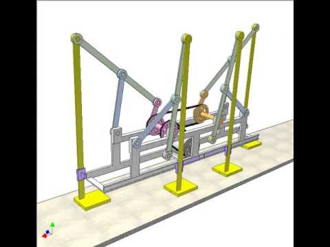

<head>
<link rel="stylesheet" href="https://maxcdn.bootstrapcdn.com/font-awesome/4.7.0/css/font-awesome.min.css">
<meta name="viewport" content="width=device-width, initial-scale=1">

</head>

<section id="two" class="spotlights">

<ul class="actions">
<li><a href="https://docs.google.com/forms/d/e/1FAIpQLSfxGp9lZC7TelZEwytV6WU0c7O_Y86gZ79Sx3pPB35nfqRg7g/viewform?usp=sf_link" target="blank" class="button sign">Sign Up Here</a></li>
</ul>

<header class="major">
<h1>Electronics</h1>
</header>

    <section>
		
		

			

				<header class="major">
					<h3>Arduino Clock</h3>
				</header>
				
Arduino is an open-source prototyping platform in electronics based on easy-to-use hardware and software. It is a microcontroller-based prototyping board capable of developing digital devices that can read inputs like a finger on a button, touch on a screen, light on a sensor etc.
                Create a clock using an Arduino in TinkerCAD, that includes timer and stopwatch features. Learn how to use Arduino’s hardware timers and interrupts, and peripherals like LCDs, buttons, and LEDs.
				

			

		

	</section>
    <section>
		
		

			

				<header class="major">
					<h3>Arduino Obstacle Avoiding Car Controller</h3>
				</header>
				
Arduino is an open-source prototyping platform in electronics based on easy-to-use hardware and software. It is a microcontroller-based prototyping board capable of developing digital devices that can read inputs like a finger on a button, touch on a screen, light on a sensor etc.
                The obstacle avoiding car is one of the simplest beginner’s robotics projects. We will learn how to control a differential drive robot, which uses an ultrasonic distance sensor to detect obstacles and steer clear of them. 
                

			

		

	</section>

<header class="major">
<h1>Mechanical</h1>
</header>

	<section>
		
		

			

				<header class="major">
					<h3>Chebyshev Lambda Mechanism</h3>
				</header>
				

				A mechanical linkage is an assembly of bodies connected to manage forces and movement.
                A kinematic chain, in which one link is fixed or stationary, is called a mechanism.
                Linkages are an integral part of robotics in fact The skeletons of robotic systems are examples of spatial linkages.
                This project aims to design and create a walking robot based on Chebyshev Lambda Mechanism. Also, learn how to use most of the tools and features of Solidworks or Fusion360 since we will do the robot’s mechanical design and assembly on Solidworks or Fusion360.
				

			

		

	</section>
    <section>
		
		

			

				<header class="major">
					<h3>Robot Gripper and Arm</h3>
				</header>
				

				If you think of a simple industrial robot as consisting of an arm, with an 'elbow' and a 'wrist' for motion and a 'hand' for picking things up, you're not being childish –in fact, you're thinking like a roboticist. Industrial robot 'arms', as they are called, do have elbows and wrists. And, at the end of the arm, robots are often fitted with what are called grippers – special devices designed to help robots handle objects in the real world. 
                This project aims to design and create a conceptual Robot arm along with its gripper. Also, learn how to use most of the tools and features of Solidworks or Fusion360 since we will do the robot’s mechanical design and assembly on Solidworks or Fusion360.
                

			

		

	</section>

<header class="major">
<h1>Automation</h1>
</header>

<section>
		
		

			

				<header class="major">
					<h3>Control of an Inverted Pendulum on a Cart</h3>
				</header>
				

				Path planning, which is basically formulating a path from the starting point to the goal point in a given environment is one of the most fundamental aspects of navigation in any form, and is used extensively throughout robotics.
                In this project, you will be learning different algorithms used for planning paths, the math behind why the algorithms work and implement them from scratch.
                

			

		

	</section>
    <section>
		
		

			

				<header class="major">
					<h3>Neural Networks and Reinforcement Learning</h3>
				</header>
				

				Neural networks have revolutionized what we can do with Machine Learning. Combined with Reinforcement Learning is allowing robots to learn a complex range of behaviors - opening up a wide range of possibilities for the field. 
				In this project we’ll learn the maths behind Neural Networks and implement our own one from scratch to emulate simple logical functions. We’ll also learn about 
                

			

		

	</section>
    <section>
		
		

			

				<header class="major">
					<h3>Path Planning with Python</h3>
				</header>
				

				Path planning, which is basically formulating a path from the starting point to the goal point in a given environment is one of the most fundamental aspects of navigation in any form, and is used extensively throughout robotics.
                In this project, you will be learning different algorithms used for planning paths, the math behind why the algorithms work and implement them from scratch.
                

			

		

	</section>
    <section>
		
		

			

				<header class="major">
					<h3>Computer Vision based Line Follower</h3>
				</header>
				

				A line follower robot is a robot which follows a particular line made on the ground by using a feedback mechanism. With the advent of fields such as Deep Learning, there has been an increasing usage of Computer Vision in robotics for perception. 
                In this project, you will be making a line following-robot which uses computer vision to detect the line and follow it instead of primitive sensor based methods.
                

			

		

	</section>
</section>

